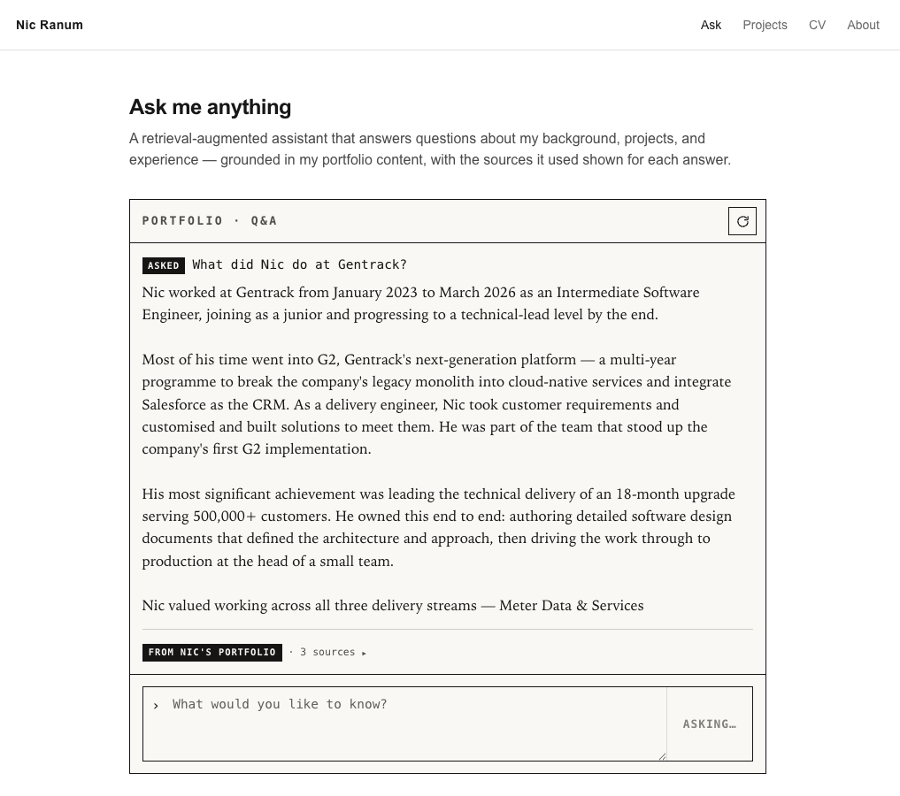
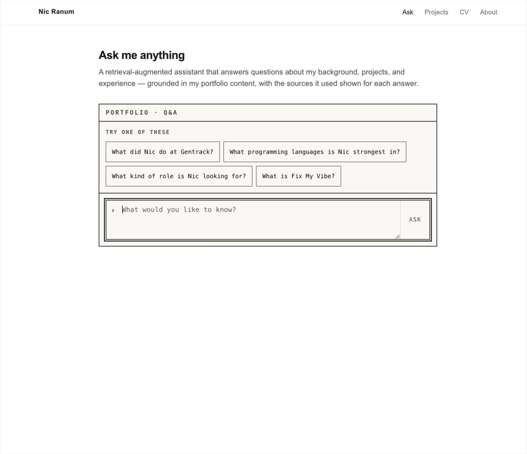
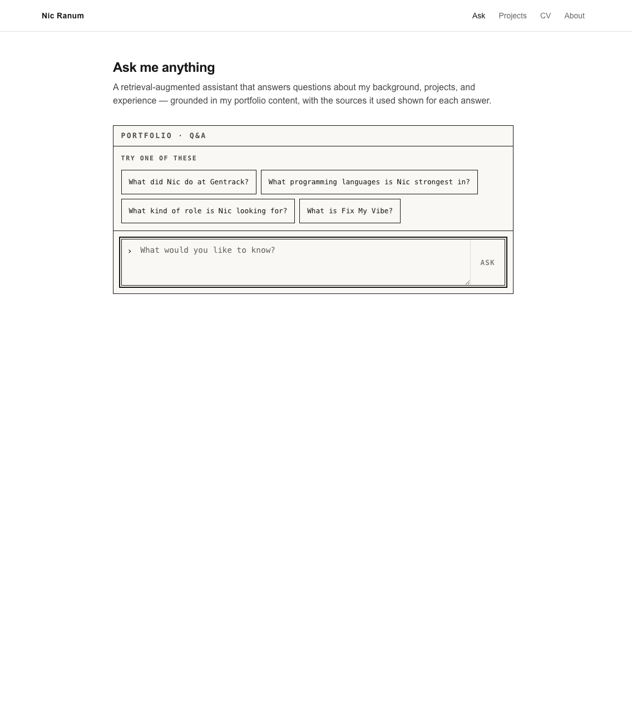
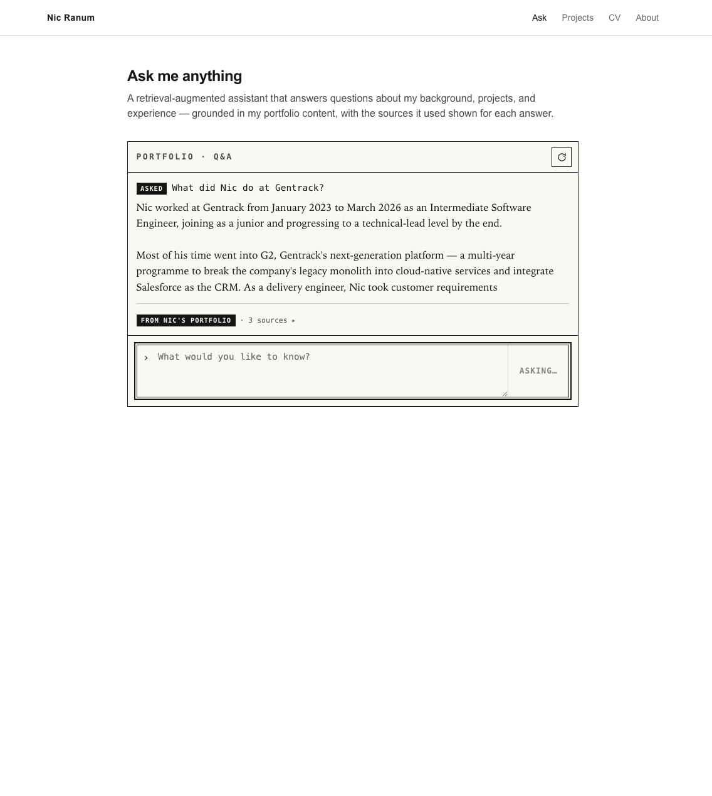
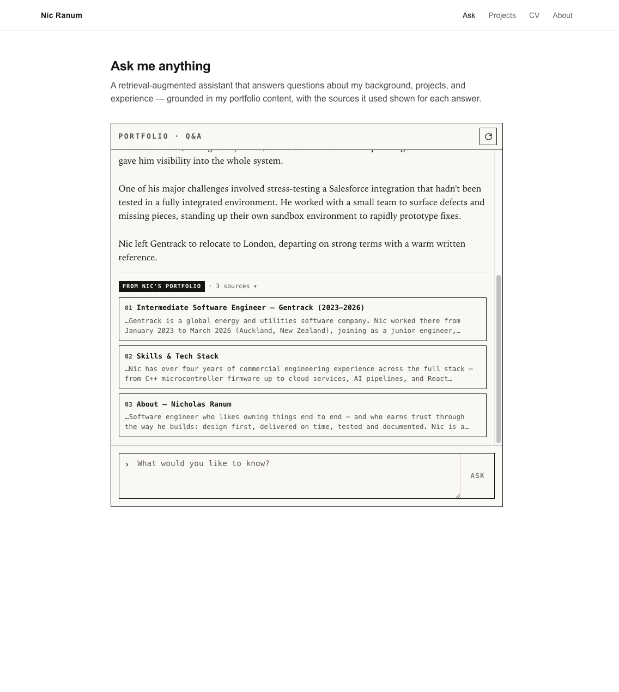
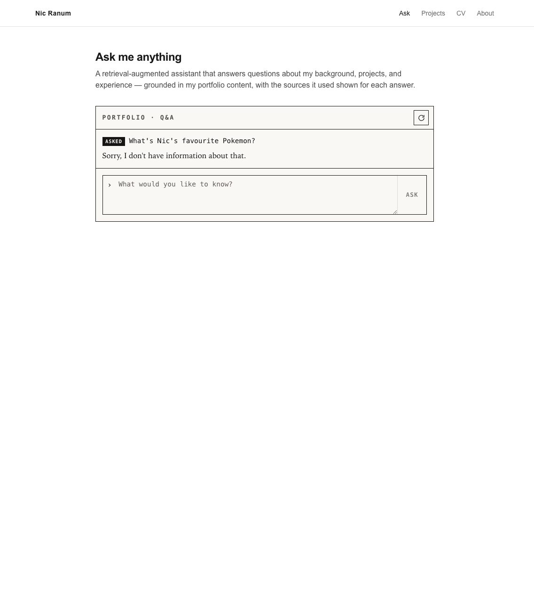
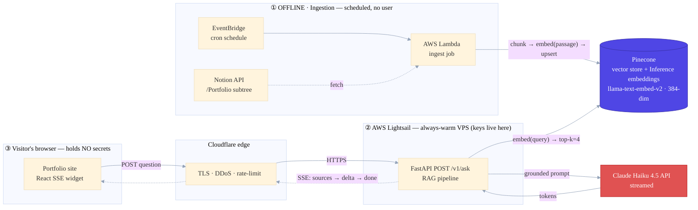
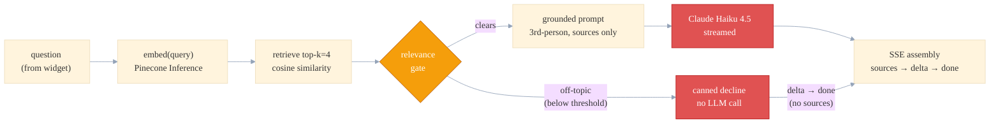

# ama-rag

An **"ask me anything" portfolio widget** — visitors to Nic's personal site ask natural-language
questions about his background and get **grounded, conversational answers**, streamed token by
token with the exact source passages cited. The model answers *about* Nic, in the third person,
and only from curated content: nothing outside the knowledge base can ever surface in an answer.


[](LICENSE)

<!-- HERO: the widget mid-answer — streamed text with source cards below. ~900px wide. -->


## Why it exists

A CV is a static list; a recruiter's real questions ("has he shipped anything with
streaming?", "what's his cloud experience?") don't have a fixed place on the page. This is a
retrieval-augmented widget that answers those questions in Nic's own documented words — pulling
the relevant passages from a curated Notion knowledge base, grounding the model in them, and
showing the visitor exactly which sources the answer came from.

The portfolio value isn't only the widget — it's the **traceable engineering behind it**. Every
piece is designed, ticketed, and committed with the decision it implements, across four layers:
offline ingestion, an online RAG query pipeline, the streaming API, and the browser widget. The
design is settled and documented in [`docs/`](docs/); this repo is the execution of it.

## Demo

<!-- DEMO GIF: one full cycle — type a question, watch it stream, source cards appear, then an
     off-topic question that trips the relevance gate and gets a polite decline. ~900px, <10s. -->


> _One question answered from the knowledge base with sources, then an off-topic question the
> relevance gate declines before the model is ever called._

## Features

**Grounded answers, not guesses**

- Retrieves the most relevant curated passages and answers **only** from them — third-person, never impersonating Nic.
- A **hybrid relevance gate** short-circuits off-topic questions with a canned decline *before* the LLM is called — cheap, hallucination-proof, and injection-resistant.
- Every answer streams with **source cards** — the exact passages it drew from, grouped by page.

**Streaming, single-turn API**

- `POST /v1/ask` streams **Server-Sent Events**: `sources` → `delta` (per token) → `done`, with a graceful `error` event on failure.
- Stateless and single-turn by design; question length-capped, CORS-locked, and rate-limited (`429` returned *before* the stream opens).

**First-party browser widget**

- An inline `'use client'` Next.js component — no iframe, no embed bundle, no secrets in the browser.
- Hand-rolled `fetch` + SSE parser (native `EventSource` is GET-only), driven by a typed `useReducer` state machine.
- **Accessible**: a hidden `aria-live` region announces the completed answer; style-isolated via CSS Modules.

**Curation as a safety boundary**

- The Notion `Portfolio` section *is* the inclusion boundary — content outside it is never embedded, so it can never be retrieved.
- The boundary holds on **removal too**: a mark-and-sweep reconcile deletes chunks for any page moved out of `Portfolio` on the next sync.

## Screenshots

<!-- Capture these from the running widget (npm run dev in web/ + the backend). Drop the PNGs in
     docs/screenshots/ under these names — see docs/screenshots/README.md for the shot list. -->
<table>
  <tr>
    <td width="50%" valign="top"><br><sub>The idle widget — the ask box with suggested-question chips.</sub></td>
    <td width="50%" valign="top"><br><sub>An answer streaming in token by token as the SSE <code>delta</code>s arrive.</sub></td>
  </tr>
  <tr>
    <td width="50%" valign="top"><br><sub>Source cards from the <code>sources</code> event — grouped by page, with a preview and “read more →”.</sub></td>
    <td width="50%" valign="top"><br><sub>An off-topic question politely declined by the relevance gate — no sources shown.</sub></td>
  </tr>
</table>

## Architecture

A RAG system is really **two pipelines that run at different times**, joined at a single seam:
they must embed text with the *exact same* hosted model, or retrieval is meaningless. In
production that seam is the **Pinecone** index — the **offline** ingestion pipeline writes to it
on a schedule, and the **online** query pipeline reads from it per request. The zoom-out design
lives in [`docs/RAG_System_Architecture.md`](docs/RAG_System_Architecture.md).

### Production topology

Ingestion runs unattended on **Lambda + EventBridge**; serving runs on an **always-warm Lightsail
VPS behind Cloudflare**, so the SSE connection streams natively with no proxy buffering. Both
pipelines meet at **Pinecone** — ingestion embeds each chunk as `passage` and upserts; the query
path embeds the question as `query` and retrieves the top-k. Secrets (Pinecone, Anthropic) live
only on Lightsail — the browser widget holds none.



### Inside the RAG pipeline

What the `FastAPI /v1/ask` box does on each request. A **hybrid relevance gate** short-circuits
off-topic questions with a canned decline *before* Claude is ever called — cheap, hallucination-proof,
and injection-resistant. A decline and a real answer both leave through the **same SSE assembly**,
so the widget has one code path for both; the difference is only that a gate decline sends **no
`sources` event**, while a real answer streams `sources` once up front, then the `delta`s.



## Tech stack

**Backend (Python 3.12)**

- **FastAPI** + **uvicorn** — the `POST /v1/ask` SSE endpoint.
- **anthropic** — Claude Haiku 4.5 via the Messages API, streamed.
- **pinecone** — hosted embeddings (Pinecone Inference) + the production vector store.
- **chromadb** — the local dev vector store.
- **notion-client** — Layer 1 content fetch.
- **ruff · mypy (strict) · pytest** — lint, type-check, test.

**Widget (`web/`)**

- **Next.js 15** (App Router) + **React 19** + **TypeScript 5.7**.
- **Vitest** — unit tests for the SSE parser, reducer, and source grouping.

## Getting started

The repo is a **monorepo**: the Python backend at the root, the Next.js widget in
[`web/`](web/) (which has its own [README](web/README.md)).

### Backend

Requires **Python ≥ 3.12**.

```bash
python3 -m venv .venv && source .venv/bin/activate
pip install -e ".[dev]"          # both layers + ruff/mypy/pytest
cp .env.example .env             # then fill in the keys (Pinecone, Anthropic, Notion)
```

Dependencies split by layer as optional groups: `.[ingest]`, `.[query]`, `.[dev]` (= all).
Embedding is a **hosted API call** — there is deliberately no `sentence-transformers` / `torch`.

Run ingestion (Layer 1), then serve the API (Layer 2):

```bash
python -m ingest.sync                          # Notion → chunk → embed → vector store
python -m query.cli "What's Nic's experience with AWS?"   # Phase-1 CLI (retrieve → gate → answer)
uvicorn query.api:app --reload --port 8000     # local API — POST /v1/ask (SSE)
```

The vector-store backend is selected by `VECTOR_STORE` in `.env` (`chroma` local / `pinecone` prod);
embeddings are Pinecone Inference either way.

### Widget

```bash
cd web
npm install
npm run dev        # http://localhost:3000  (needs the backend running above)
```

The widget calls `NEXT_PUBLIC_API_BASE_URL` (`.env.local`, default `http://localhost:8000`).

## Checks

Run before marking any ticket done — these gate every commit.

```bash
# backend (repo root)
ruff check . --fix && ruff format .
mypy .
pytest -q

# widget (web/)
npm run typecheck
npm test
```

## Project structure

```
config.py       locked embedding model + all Layer-2 knobs (the L1↔L2 seam)
ingest/         Layer 1 — Notion fetch, chunker, hosted embed + store, sync/reconcile
query/          Layer 2 — retrieval, relevance gate, prompt, generation, FastAPI API, CLI, calibration
scripts/        create the Pinecone index, lock the embedding model, run ingestion
deploy/         Lightsail systemd unit + deployment runbook (Layer 4)
tests/          pytest suite (one file per module)
web/            Layer 3 — the Next.js 'use client' widget (own README, package.json, Vitest)
docs/           authoritative design + decision logs (read before changing behaviour)
```

## Status & roadmap

Work is tracked as tickets in a Notion `DB Action Items` database, linked to the RAG project page;
**Notion is the live source of truth for status.** Each commit carries its Req-ID, e.g.
`feat(ingestion): chunker [M1.4-01 · L1 chunking]` — the git history reads as a design → ticket →
code lineage.

- **M0** — foundations: accounts, embedding-model lock, Pinecone index at the locked dimension.
- **M1** — Layer 1 ingestion: Notion fetch → chunk → hosted embed → vector store + sync/reconcile.
- **M2** — Layer 2 pipeline & serving: retrieval, relevance gate, grounded prompt, streamed generation, FastAPI SSE, calibration.
- **M3** — Layer 3 widget: the `'use client'` SSE consumer, source cards, accessibility, suggested-question chips.
- **M4** — cloud rollout: prod Pinecone, Lightsail + Cloudflare, ingestion on Lambda + EventBridge, real-content swap, end-to-end verification.
- **Next** — the public portfolio content pages the source links point to, then observability / cost / answer-quality (a future Layer 4).
